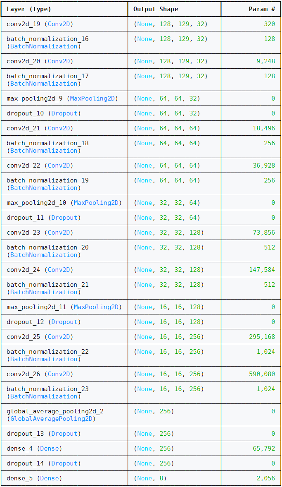

# Podejścia do tworzenia sieci neuronowej

W tym repozytorium zaprezentowano **dwa podejścia** do problemu tworzenia sieci neuronowej.

---

## 1. Tworzenie własnej sieci neuronowej

To podejście rozbito na dwie próby:

### 1.1 Prosta architektura
Sieć zawiera **10 warstw** i **3,305,096 parametrów**. Model trenowano przez **20 epok**.

### 1.2 Złożona architektura

Posiada więcej warstw części konwolucyjnej, która służy do **ekstrakcji cech**. Zastosowano warstwę **GlobalAveragePooling2D()** zamiast **Flatten()**, co zmniejsza liczbę parametrów w warstwach w pełni połączonych (FC).

#### Różnica między warstwami:
**GlobalAveragePooling2D()**: dla każdej mapy cech (kanału wyjścia warstwy konwolucyjnej) pobiera średnią wartość, tworząc wektor o długości `batch_size * channels`.
**Flatten()**: pobiera wszystkie wartości z każdej mapy cech, tworząc wektor o długości `batch_size * height * width * channels`.

Dzięki zastosowaniu **GlobalAveragePooling2D()**, złożona architektura modelu zawiera **1,243,368 parametrów**.

Kształt danych wejściowych obu modeli oparto na kształcie spektrogramów – sieci przyjmują **jednokanałowy obraz** (dwuwymiarową tablicę wartości).

---

## 2. Dostrojenie istniejącej sieci VGG19

Drugim podejściem było **dostrojenie istniejącej konwolucyjnej sieci neuronowej VGG19**, wytrenowanej do klasyfikacji obrazów. Opracowana przez zespół **Visual Geometry Group (VGG)** na Uniwersytecie Oksfordzkim. Opublikowana w artykule: *“Very Deep Convolutional Networks for Large-Scale Image Recognition”* (ICLR 2015).

### Architektura sieci VGG19
**Część konwolucyjna (feature extractor):**

Liczba parametrów (bez warstw klasyfikacyjnych): **20,024,384**. Wytrenowana na zbiorze **ImageNet** z **1000 klasami** i **1.2 miliona próbek**.

### Proces dostrajania

1. Dodano do części konwolucyjnej VGG19 **warstwy FC pełniące rolę klasyfikatora**.
2. Trenowano model przez **10 epok**.
3. Odmrożono ostatnie **8 warstw** i wznowiono trenowanie na kolejne **10 epok**.

Model na wejściu przyjmuje **trójkanałowy obraz (R, G, B)**, dlatego spektrogramy zostały zdublowane na każdy kanał.  
Zwiększona ilość danych wejściowych znacznie wydłużyła czas trenowania modelu.