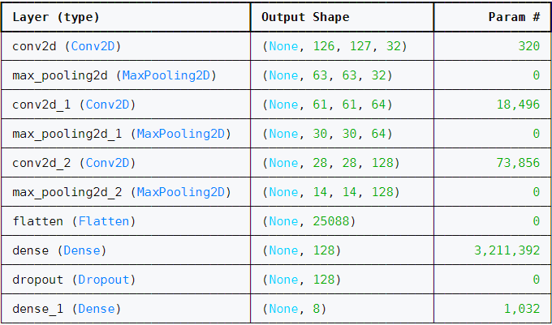
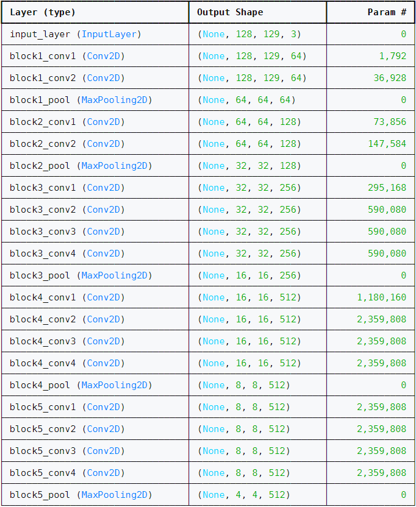

W tym repozytorium zaprezentowano 2 podejścia do problemu tworzenia sieci neuronowej. Pierwszym z nich jest utworzenie autorskiej sieci neuronowej o prostej architekturze:

która zawiera 10 warstw i 3,305,096 parametrów.
Model trenowano przez 20 epok.

Kształt danych wejściowych modelu oparto na kształcie spektrogramów przez co przyjmuje on jednokanałowy obraz (dwuwymiarową tablicę wartości).

Drugim z nich było dostrojenie istniejącej konwolucyjnej sieci neuronowej wytrenowanej do klasyfikacji obrazów o nazwie VGG19 opracowanej przez zespół z Visual Geometry Group (VGG) na Uniwersytecie Oksfordzkim.

Modele zostały opublikowane w artykule z 2014 roku: “Very Deep Convolutional Networks for Large-Scale Image Recognition” (ICLR 2015).

Architektura sieci VGG19 (część konwolucyjna, tzw. "feature extractor"):

Liczba parametrów tej sieci (bez warstw klasfikacyjnych) wynosi 20,024,384.

Została ona wytrenowana na zbiorze ImageNet zawierającym 1000 klas oraz 1.2 miliona próbek.

W ramach dostrajania stworzono nową sieć dodając do częsći konwolucyjnej VGG19 warstwy w pełni połączone (FC) pełniące role klasyfikatora.

Następnie przez 10 epok uczono taki model. Po czym odmrożono ostatnie 8 warstw modelu i wznowiono trenowanie modelu na następne 10 epok.

Model na wejściu przyjmuje trójkanałowy obraz (Kanały R, G oraz B) przez co przed trenowaniem potrzebne było przekształcenie danych wejściowych duplikując spektrogram dla każdego kanału. Zwiększona ilość danych wejściowych znacznie wydłużyła czas trenowania modelu.
