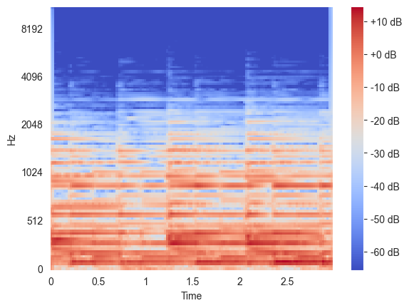

Ta konwolucyjna sieć neuronowa (ang. Convolutional neural network, w skrócie CNN) została wytrenowana na zbiorze danych Medley-Solos-DB.

Medley-Solos-DB to kolekcja 3 sekundowych monofonicznych klipów audio (każdy klip zawiera tylko jeden instrument). Składa się on z danych treningowych które zostały wyodrębnione ze zbioru danych MedleyDB autorstwa Bittner i in. (ISMIR 2014), a także zbioru testowego składającego się z 3-sekundowych klipów, wyodrębnionych ze zbioru solosDB autorstwa Essid i in. (IEEE TASLP 2009). Taki podział danych pozwala sprawdzić czy wytrenowany model potrafi uogólniać wiedzę na nagrania z innych źródeł niż te, ze zbioru treningowego.

W celu wytrenowania sieci neuronowych dla każdej próbki wygenerowano mel frequency spectrogram. Jest to widmo częstotliwościowe sygnału audio, przedstawione w skali mel, która jest bliższa percepcji ludzkiego ucha, gdzie wyższe częstotliwości są "ściśnięte" a niższe przedstawione bardziej szczegółowo. 

Przykładowy spektrogram:

