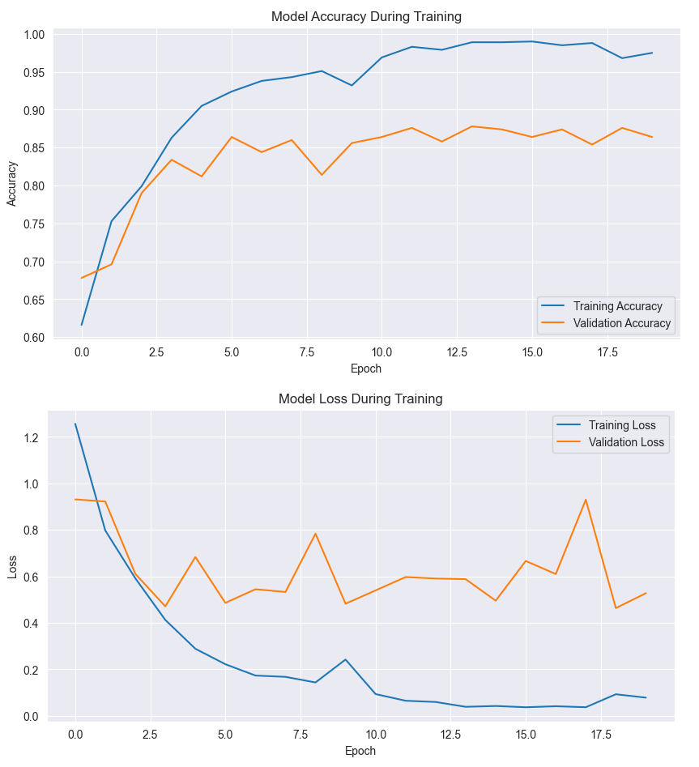
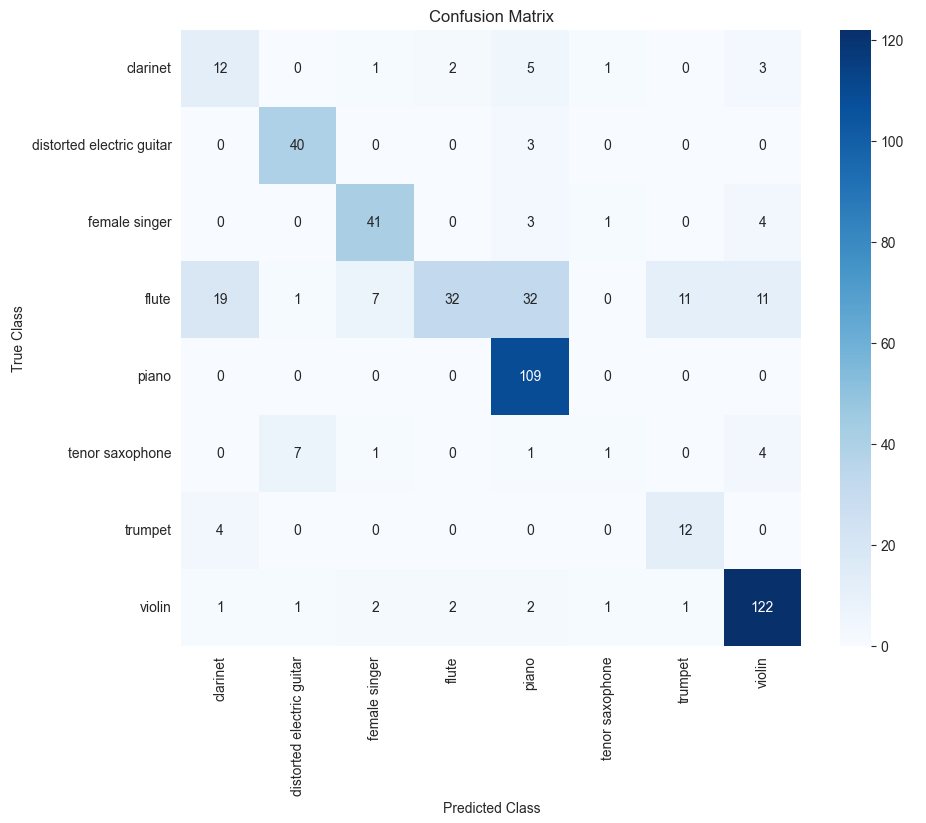
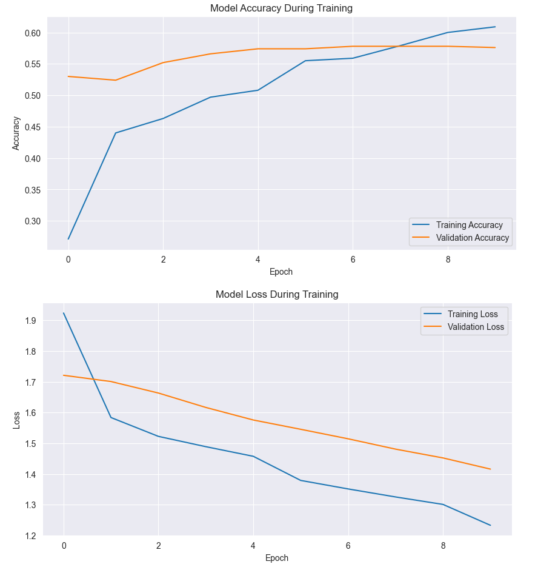
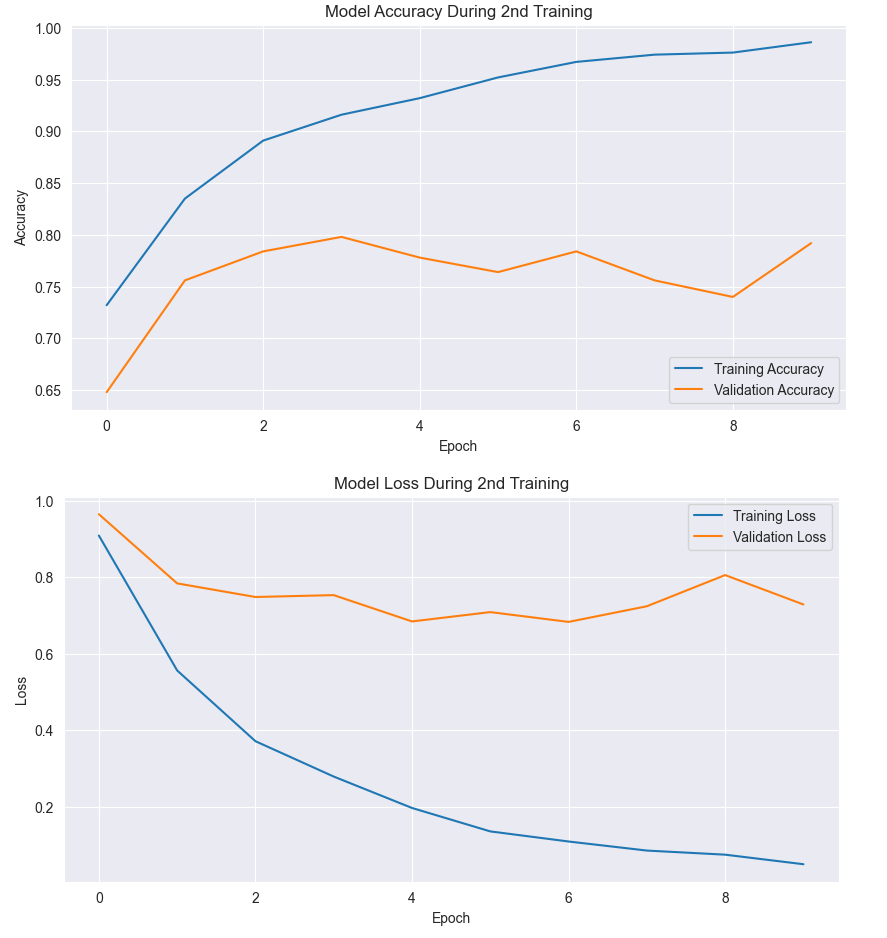
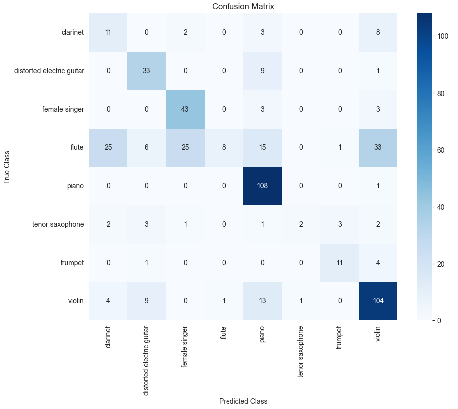

Wyniki zostały opracowane na zmniejszonym zbiorze danych (1000 próbek ze zbioru treningowego, 500 próbek ze zbioru walidacyjnego oraz 500 próbek ze zbioru testowego).

Prosty model CNN:

Evaluation Metrics:
Accuracy:    0.7380
Sensitivity: 0.6620
Precision:   0.6409
F1-Score:    0.6165

Dostrojony Model VGG19:

Pierwsza faza (wszystkie warstwy części konwolucyjnej zamrożone):

Evaluation Metrics:
Accuracy:    0.4020
Sensitivity: 0.2125
Precision:   0.2253
F1-Score:    0.1405

Druga faza (odmrożone ostatnie 8 warstw części konwolucyjnej):

Evaluation Metrics:
Accuracy:    0.6400
Sensitivity: 0.5979
Precision:   0.6460
F1-Score:    0.5463

Uwagi i Spostrzeżenia:

Powyższe wyniki otrzymano korzystając z podziału danych narzuconego przez twórców zbioru Medley-Solos-DB.
Gdy ustalono własny podział danych treningowych, testowych oraz walidacyjnych modele miały znacznie wyższą dokładność. Dzieje się tak prawdopodobnie dlatego, że w podziale narzuconym przez twórców zbiory pochodzą z różnych źródeł, przez co model może klasyfikować próbki wyłącznie po brzmieniu instrumentu, w naszym podziale dane zostały wymieszane, przez co w niektórych przypadkach model może klasyfikować próbki po innych czynnikach, m.in. warunkach nagrania.